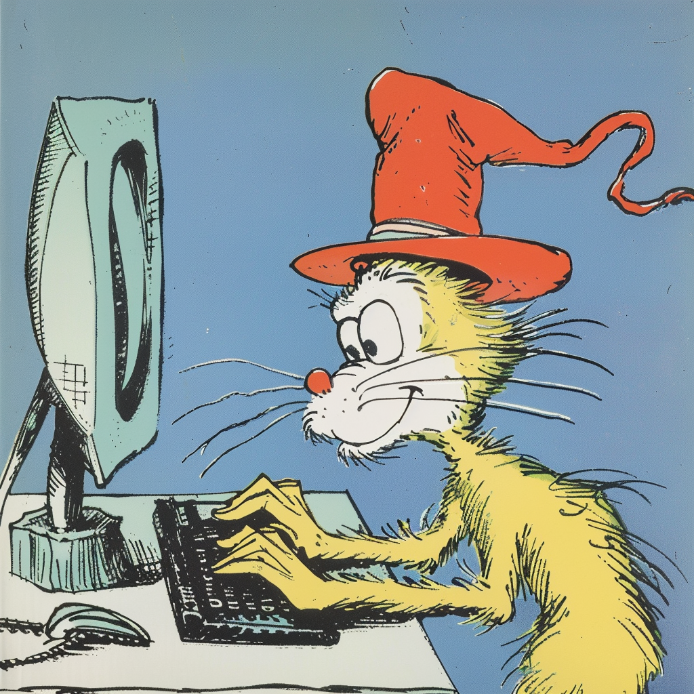

<style>
@font-face {
  font-family: 'Grinched';
  src: url("./fonts/GrinchedRegular.otf");
}

@font-face {
  font-family: 'Doctor Soos Light';
  src: url("./fonts/Doctor Soos Light.ttf");
}

h1, h2 {
  color: black;
  font-family: 'Grinched';
}

code, marp-pre {
  font-family: courier;
  color: black;
  font-size: 100%;
  background: none;
}

marp-pre {
  display: flex;
  justify-content: center;
  transform: scale(2.5);
}

footer {
  font-family: 'Doctor Soos Light';
  color: black;
  transform: translate(0, 15%);
}

ul > li {
    list-style-type: none;
}

#oh-the-methods-you-can-make {
  transform: translate(0, -220%);
}

#by-dunder-seuss {
  transform: translate(0%, 300%);
}

#for-dottie-and-teddy-with-love {
    font-family: 'Doctor Soos Light';
}


[alt="arrow1"] {
  transform: rotate(270deg) translate(0%, 150%);
}

[alt="arrow2"] {
  transform: rotate(270deg) translate(60%, -150%);
}

[alt="arrow3"] {
  transform: rotate(270deg) translate(-40%, 150%);
}

[alt="arrow4"] {
  transform: rotate(60deg) translate(-50%, 190%);
}

[alt="arrow5"] {
  transform: rotate(90deg) translate(-160%, 150%);
}

[alt="arrow6"] {
  transform: rotate(90deg) translate(0%, 150%);
}

</style>



# Oh the (Methods) You Can (Make)

## By Dunder Seuss

---

## About the author


<!--
Josh Cannon, aka "Dunder Seuss" has written no books so far, has been on a single podcast, and done
exactly one talk before he decided to write this book.

Josh is a Build Engineer by day,
a maintainer of the Pantsbuild Open Source Build System also by day.
And sometimes participates in other open source projects, Python community discussions,
and conference speaking... also by day.

He's a lover of getting to know enough Python to make expressive, readable, and intuitive code.
He wrote this book to teach others of the power and magic that you can bring to your objects to make them
expressive, readable, and intuitive.
-->

---

## For Devon, Dottie, and Teddy, with Love

---

<!-- transition: slide -->


<!--
Congratulations!
Today is your day.
You will soon learn you some magic,
the good and proper way.

You've chosen a wise way to spend your precious time
by learning from a crazy loon going on in rhyme
about a list of methods that are nicknamed "the dunders"
and how you'll use them to code great wonders
-->

---

<!-- transition: swipe -->
<!-- _class: lead magic -->

`__magic__`


<!--
They start with two underscores, and end with two more
thus "dunder" which is short for "double underscore"

The runtime of Python calls them in many situations
allowing _your_ objects many customizations
-->

---

<!-- transition: slide -->


<!--
You'll learn all about how to emulate a container
and iterators and numbers from a great explainer
Comparisons, callables, and descriptors too,
and how to make attributes appear out of the blue.

You'll learn some new names, and I know you'll learn many
at least one if not two, maybe even up to twenty

By the end you'll know magic, know magic galore
you'll be so full of magic, you'll yell "please sir no more"!

So with great skillful skill, and lots of caffeine
let's start off your learning... with a method you've seen
-->

---

<!-- transition: swipe -->

```python
def __init__(self, ...): -> None:
    self.x = ...
    self.y = ...
```

<!--
Let's pretend you're new to Python, just for a minute
you'll then learn the first magic: `__init__`
It is almost every object's _initializer_,
allowing you to be an attribute organizer
adding new attributes to your fresh new object.
The most common magic, I truly do suspect.
-->

---

<!-- transition: slide -->


<!--
But,
where did `self` come from?
You'll soon start to wonder

Then you'll learn that its created by just another 'dunder
One that _constructs_ the blank object to give to you
And it's name, you'll soon find, is `__new__`.
-->

---

<!-- transition: swipe -->

```python
def __new__(cls):
    self = object.__new__(cls)
    return self  # --> __init__(self, ...)

def __new__(cls):
    return 1  # --> caller
```

<!--
It's a special static method you'll maybe define in your class
which returns _some_ object, then onward its passed,
to whom it turns out depends on the returned object's type
if its an instance of your class (including a possible subtype)
"it goes to `__init__`" you'll hear from the scholar
"but otherwise", he'll says, "it's back to the caller"
-->

---

<!-- transition: slide -->

```python
def __new__(cls, *args, **kwargs):
    cls = (
        WindowsPath if os.name == 'nt'
        else PosixPath
    )
    return object.__new__(cls)
```

<!--
You'll see this in action, and it'll be more clear-y
by looking for it's use in the standard library
`pathlib.Path` uses this method to help it perform
constructing an object specific to _your_ platform.
The type, as you'll find, has defined `__new__`,
to return a subclass' instance specific to _you_.
-->

---

<!-- transition: swipe -->


<!--
Now, with great careful care, and great tactful tact,
you'll see using it is a great balancing act.
A magic with the power to create objects that are new,
is something to avoid misuse of, too.
-->

---

<!-- transition: slide -->

```python
def __del__(self) -> None:
    self.fp.close()
    super().__del__()
```

<!--
And speaking of balance...

the opposite of `__new__` is not oft employed,
`__del__` is called right before your object is destroyed.
You'll use it to release resources you've acquired
but only if you want, its definition isn't _required_
But if you do write it, heed this warning as well,
you **MUST** call your `super()`'s `__del__`.
-->

---

<!-- transition: swipe -->


<!--
The next set of magics involve conjuring illusions,
of attributes, giving your callers delusions
that your object has more (or less) than it does
why? friendly interfaces is likely the because.
-->

---

<!-- transition: slide -->

```python
class Numbers:
    def __getattr__(
        self,
        key: str,
    ):
        if key == "inf":
            raise AttributeError(key="inf", obj=self)
        return int(key)

Numbers().one  # 1
```

<!--
First on your journey through attribute emulation,
`__getattr__` is the proper incantation
you'll type it out with a flick and a twist
and you'll synthesize attributes that don't exist.
It's called when default attribute access fails,
The attribute simply wasn't in the details.
You'll get a chance to pretend it existed
However, on your object, the attribute isn't persisted.
Now, if you wish to pretend you don't recognize this `name`,
`raise AttributeError` emulates that all the same.
-->

---

<!-- transition: swipe -->

```python
def __getattribute__(
    self,
    key: str,
):
    if key in dir(self):
        return super().__getattribute__(key)
    return int(key)
```

<!--
It has an alter-ego, named `__getattribute__`, you'll see
which is called for all access, _unconditionally_
It gets called for names both existing and not,
but beware, infinite recursion is easily got
if you happen to type out "self-dot".
So remember when you need to access your attributes inside of your thing,
you wont use `self.`, you'll give your `super()` a ring
-->

---

<!-- transition: slide -->

```python
class AttrAdder:
    def __setattr__(
        self,
        key: str,
        value,
    ) -> None:
        self.__dict__[key] = value

x = AttrAdder()
x.cheese = "please"
x.gizmo = "whizmo"
```

<!--
To juxtapose "get", `__setattr__` is how,
attribute _setting_, your classes allow.
Again, by default the attribute isn't persisted,
you get to choose whether it becomes listed.
This is also called for all attributes without any condition,
(whether it exists or not) without your permission.
-->

---

<!-- transition: swipe -->

```python
def __delattr__(self, key: str):
    del self.__dict__[key]
```

<!--
The last of the attr methods, you'll maybe leave off,
define `__delattr__`, and people might scoff.
As you'll probably guess its good for emulation
of the removal of a name from your object's formation.
And just like `__setattr__`'s unfortunate asymmetry,
it gets called for all names, unconditionally.
-->

---

<!-- transition: slide -->


<!--
You'll then find out soon enough,
that when it comes to illusory stuff
attribute names is just where it starts
there's more you'll learn: another TWO parts
yes, like all good things these magics come in three
in more ways than one, you'll soon see
the first way is the trio of names "get", "set", and "del"
then how they're used for other illusions as well

The second in our trio-of-trios, I'll teach to you now,
these methods are so powerful. You'll see how,
an attribute gets to customize _itself_
instead of sitting _static_ on some other object's shelf.
-->

---

<!-- transition: swipe -->

```python
class Model:
    id = IDColumn(...)
    name = StrColumn(..._)
```


<!--
"Descriptors" is the name given to this technique
of attributes themselves, using doublespeak.

First these things work as attributes of a class
(you'll see Django and SQLAlchemy use this en masse)
The "descriptor" is the attribute, and it gets a say
on how _it_ gets gotted, setted, and deleted, per se
-->

---

<!-- transition: slide -->

```python
def __get__(
    self,
    instance: object | None,
    owner: type | None = None,
):
    if instance is None:
        # Class attribute access
        # E.g. `Foo.attr`
        return ...
    else:
        # instance attribute access
        # E.g. `foo.attr`
        return ...

```

<!--
`__get__` is the first of these spells you'll want to perfect
conjuring values for attributes based on the owner's object
(or sometimes the class, as callers sometimes will do,
so your `__get__` should support that too)
-->

---

<!-- transition: swipe -->

```python
class staticmethod:
    def __get__(self, instance, owner):
        return self.function

class classmethod:
    def __get__(self, instance, owner = None):
        cls = owner
        if cls is None:
            cls = type(instance)
        return types.MethodType(self.function, cls)

class property:
    ...
```

<!--
And usage of descriptors you'll find sooner, not later,
they're used for several built in decorators,
`staticmethod`, `classmethod`, and `property` all use
this technique to customize your attributes for you
-->

---

<!-- transition: slide -->

```python
def __set__(self, instance, value) -> None:
    ...

def __delete__(self, instance) -> None:
    ...
```

<!--
Just like `__getattr__`, `__get__` has two brothers,
`__set__` and `__delete__` are the others.
They act just like `__get__` in proxying a call,
and can do anything they want, both big and small.
-->

---


<!-- transition: swipe -->

```python
my_row.column_name


type(my_row).column_name.__get__(
    my_row,
    type(my_row),
)


def __get__(self, instance, owner = None):
    return = ENGINE.run(
        "SELECT <column> FROM <table> WHERE <table>.id = <id>",
        ...,
        id = instance._id,
    )
```


<!--
You've maybe have wondered, and even had a theory,
how SQL ORM's quickly fire off a query,
when you access certain attributes in your class you set
the "Column" "descriptor" is leveraging `__get__`
to run a SQL query, using the instance's database ID,
and return to you the value (and maybe cache it, you see).

You'll see `__set__` gets called for attribute assignment,
A SQL `UPDATE` is likely used for new value enshrinement

Lastly, `__delete__` when an attribute is told to go bye-bye
a SQL `DELETE` you'll likely see fly by.
-->

---

<!-- transition: slide -->

```python
class Model:
    first_name = Column()
    second_name = Column()
# ==> Model.first_name.__set_name__("first_name")
# ==> Model.second_name.__set_name__("second_name")

def __set_name__(self, name: str) -> None:
    self._name = name
```

<!--
There's one more method, that plays in this game,
and it's a method that goes by `__set_name__`
our "trio" really is four, oh well, what a shame.

At the end of your class definition, you see,
for all of the class attributes that be,
if they define a `__set_name__`,
the attribute's name, Python will disclaim.
-->

---

<!-- transition: swipe -->


<!--
And thus the _attribute_ shell game, now comes to a close
the illusions of _attributes_, we have now exposed
the last trio-of-trios, you'll learn from your trainer,
is emulating _items_ inside of a container
-->

---

<!-- transition: slide -->

```python
def __getitem__(self, key):
    ...

def __setitem__(self, key, value):
    ...

def __delitem__(self, key):
    ...

```

<!--
You'll see this time our trio's suffix is `item`,
to help quack like containers with things inside 'em

They are given the key (and in one case, the value)
implementing container semantics are then up to you.

-->

---

<!-- transition: swipe -->

```python
class SequenceLike:
    def __getitem__(self, index: int | slice):
        if index >= self.length:
            raise IndexError(...)
        return self._underlying[index]
```

<!--
`__getitem__` has different behaviors on the radar
depending on the type of container your are
Your sequence types (which quack like a tuple or a list)
will accept keys as integers and slice objects
Negative int support is something you can choose
to allow or not, is simply up to you.
If a value provided is outside of your bounds
an `IndexError` your code should resound
-->

---

<!-- transition: slide -->

```python
class MappingLike:
    def __getitem__(self, key):
        ...
        if key not in self._keys:
            raise KeyError(...)
        ...
```

<!--
otherwise, if your container has a Mapping background,
you'll raise `KeyError` if the key isn't found
-->

---

<!-- transition: swipe -->

```python
def __getitem__(self, key):
    if not isinstance(key, ...):
        raise TypeError(...)
    ...
```

<!--
and in every case, if you you reject the key's type
`raise TypeError` you'll then want to gripe
-->

---

<!-- transition: slide -->

```python
def __setitem__(self, key, value): ...
def __delitem__(self, key): ...

# ==> raise IndexError/KeyError/TypeError
```

<!--
You'll likely learn too,
those rules still hold true,
for the other methods two
-->

---

<!-- transition: swipe -->


<!--
And, as far as containers go, there are a few more dunders
you'll want to define, lest you commit several blunders

So although our trio of trios may have come to a close
you'll want to learn the other container methods I suppose.
-->

---

<!-- transition: slide -->

```python
def __len__(self) -> int:
    ...
```

<!--
A quick one that you'll want to define,
is `__len__` which helps Python divine
the length of your container, so when people cal `len`,
Python can return the number back to them.
-->

---

<!-- transition: swipe -->

```python
def __iter__(self) -> Iterator[...]:
    ...
```

<!--
The second one is `__iter__`, which should return an iterator
over the objects that all live inside your object container,
unless its a mapping then what your caller sees,
is simply all of the mapping's keys.
There's also this trivia, a bit of Python fun,
if your container isn't iterable, set `__iter__` to `None`!
-->

---

<!-- transition: slide -->

```python
def __contains__(self, item) -> bool:
    ...
```

<!--
Now, third on our extras is named `__contains__`,
to test if an object, your container maintains
Although technically, you don't have to define it, Python won't be bitter
-->

---

<!-- transition: swipe -->

```python
# Otherwise
for elem in obj:  # __iter__
    if elem is test or elem == test:
        return True
return False
```

<!--
Instead it'll test membership first using `__iter__`.
Going over every possible object that your object can contain,
and asking if any of those objects are equal or the same.
-->

---

<!-- transition: slide -->

```python
# Otherwise
while True:
    try:
        elem = obj[i]  # __getitem__
    except IndexError:
        return False
    if elem is test or elem == test:
        return True
```

<!--
But if you also don't define a `__iter__` method,
`__getitem__` is called and repeatedly tested,
using incrementing indexes from 0 until it then gets
an `IndexError` exception or an equal/same object.
So it's best to define it, so you'll have control,
just how the object membership test will unroll.
-->

---

<!-- transition: swipe -->

```python
def __reversed__(self) -> Iterator[...]:
    ...
```

<!--
And if for optional methods you'll have started to thirst,
another one available is `__reversed__`.
It returns an iterator for doing backwards iteration,
-->

---

<!-- transition: slide -->

```python
# Otherwise
for i in range(len(obj) -1, -1):  # __len__
    yield obj[i]  # __getitem__
```

<!--
but you'll only define it, if you beat the default computation,
that Python uses combining `__getitem__` and `__len__`
indexing backwards to 0, and then...
-->

---

<!-- transition: swipe -->

```python
def __missing__(self, key):
    ...
```

<!--
There's one more optional method if you subclass `dict`
`__missing__` can be defined so that `__getitem__` can predict
what value to use, if the key in your mapping isnt yet there
It's how `collections.` `defaultdict` or `Counter`, with care
support operations on items conjured out of thin air.
Python just returns to your caller, the value itself,
so if you want to, dont forget to store it in yourself.
-->

---

<!-- transition: slide -->


<!--
You'll find that you're done,
you've mastered container emulation
But your next set of magics form quite the combination

See, you briefly dipped your toe into the "index" operator
however you'll find the list of ops to support is oh so much greater
You'll think about `+` and `-` and start figuring
that the list of operators is biggering and biggering
-->

---

<!-- transition: swipe -->

```python
def __add__(self, right):
    if not isinstance(right, MyType):
        return NotImplemented
    return ...
```

<!--
Let's start with just one that you can define,
`__add__` lets you support the plus sign
when your object is on the left with whatevers on the right
you return the added value, except when you might
reject the operation, because you don't know what to do,
and instead return the `NotImplemented` singleton value
such is the case if you dont recognize the type
of whatever the thing is on the right.
-->

---

<!-- transition: slide -->

<style scoped>
section {
    padding-top: 150px;
    padding-left: 60px;
    padding-right: 60px;
    display:grid;
    grid-template-columns: 50% 50%;
}
ul {
    margin-top: 0;
}
section > ul > li {
    font-size: 80%
}
li code {
    color: #89bdff;
    margin: 0 5px 0 5px;
    padding: 0 0 0 0;
}
li > code:nth-child(2) {
    color: #3e87e3;
}
li > code:nth-child(4) {
    color: orange;
}
/* divmod */
ul:nth-child(1) > li:nth-child(7) > code:nth-child(2) {
    color: #89bdff;
    margin-right: -8px;
}
ul:nth-child(1) > li:nth-child(7) > code:nth-child(3) {
    margin-left: 0px;
    margin-right: -8px;
    color: #3e87e3;
}
ul:nth-child(1) > li:nth-child(7) > code:nth-child(4) {
    margin-left: 0px;
    margin-right: 0px;
    color: #89bdff;
}
ul:nth-child(1) > li:nth-child(7) > code:nth-child(5) {
    margin-left: 0px;
    margin-right: 0px;
    color: orange;
}
ul:nth-child(1) > li:nth-child(7) > code:nth-child(6) {
    margin-left: -10px;
    margin-right: 0px;
    color: #89bdff;
}

</style>

<!-- prettier-ignore -->
* `__add__` -> `obj` `+` `right`
* `__sub__` -> `obj` `-` `right`
* `__mul__` -> `obj` `*` `right`
* `__truediv__` -> `obj` `/` `right`
* `__floordiv__` -> `obj` `//` `right`
* `__mod__` -> `obj` `%` `right`
* `__divmod__` -> `divmod(` `obj` `,` `right` `)`

<!-- prettier-ignore -->
* `__lshift__` -> `obj` `<<` `right`
* `__rshift__` -> `obj` `>>` `right`
* `__pow__` -> `obj` `**` `right`
* `__and__` -> `obj` `&` `right`
* `__xor__` -> `obj` `^` `right`
* `__or__` -> `obj` `|` `right`
* `__matmul__` -> `obj` `@` `right`

<!--
Then...

`__sub__` for subtraction, `__mul__` for times,
`__truediv`- of `floordiv` depending on the kind,
of division you want, true or integer, respectively
using one slash or two, for division, collectively.
And speaking of operations that come in pairs,
modulo arithmetic is a double-dunder-affair,
with `__mod__` for modulo support and then,
`__divmod__` to support the `divmod` builtin.
The last of the pairs of magic method gifts,
is `__l`- and `__rshift`
Then next up is `__pow__` for "to-the-power-of" support
whose operator is two askerisks, side-by-side, for short
and then, although the list was already so long
three more dunder methods will came along
`__and` - `xor`- and `or__`, oh come now, don't gripe,
they're how you support ampersand, caret and pipe.
And then, when your object supports the at-symbol,
the method you'll want is named `__matmul__`

AND THEN, that was it, there won't be more later
FOURTEEN methods for numeric operators,

unless...

Unless you think that this isn't enough.
[[Here let's take a poll, is there other number stuff
we need to define? If yes raise your hand]]
I see. I suppose our list should expand.
-->

---

<!-- transition: swipe -->


<!--
You'll maybe be asking yourself "O' teacher, how come?"
You'll ask yourself where these new methods are from
and how come my methods sometimes return `NotImplemented`,
if, to my caller, a `TypeError` is presented?
-->

---

<!-- transition: slide -->

```python
__add__(left, right) --> NotImplemented
```


```python
if type(left) is not type(right)
```


```python
def __radd__(right, left): ...
```

<!--
And so our list of methods then expands,
to support the same things with swapped operands,
but only if the result is `NotImplemented`
AND if two different types are presented,
Python tries again but this time with an "R",
at the front of the name, (it's not _that_ bizarre)
and calls this other method on the thing on the right,
let's see an example to bring how this works to light
-->

---

<!-- transition: swipe -->

```python
[1, 2, 3] - Foo()
# ==>
def __rsub__(self, left):
    ...
```

<!--
Let's say someone subtracts from a `list` your `Foo`,
well `list` doesn't know what the heck to do,
so it's `__sub__`, then returns `NotImplemented`,
then the runtime continues on as documented,
noticing that `list` and `Foo` are different classes
and calls `Foo`'s `__rsub__`, and it passes
the listuplet object on which we've acted
so `Foo` can say how it should be subtracted.

Now remember, you'll have to be dextrous and deft,
and try not to mix up a right "op" with a left,
when in an "r-method" you're the one on the right
getting this correct will make you seem bright

-->

---

<!-- transition: slide -->

<style scoped>
section {
    padding-top: 70px;
    padding-left: 60px;
    padding-right: 60px;
    display:grid;
    grid-template-columns: 50% 50%;
}
ul {
    margin-top: 0;
}
section > ul > li {
    font-size: 65%
}
li code {
    color: #89bdff;
    margin: 0 5px 0 5px;
    padding: 0 0 0 0;
}
ul:nth-child(1) > li > code:nth-child(2) {
    color: #3e87e3;
}
ul:nth-child(1) > li > code:nth-child(4) {
    color: orange;
}
/* divmod */
ul:nth-child(1) > li:nth-child(7) > code:nth-child(2) {
    color: #89bdff;
    margin-right: -8px;
}
ul:nth-child(1) > li:nth-child(7) > code:nth-child(3) {
    margin-left: 0px;
    margin-right: -8px;
    color: #3e87e3;
}
ul:nth-child(1) > li:nth-child(7) > code:nth-child(4) {
    margin-left: 0px;
    margin-right: 0px;
    color: #89bdff;
}
ul:nth-child(1) > li:nth-child(7) > code:nth-child(5) {
    margin-left: 0px;
    margin-right: 0px;
    color: orange;
}
ul:nth-child(1) > li:nth-child(7) > code:nth-child(6) {
    margin-left: -10px;
    margin-right: 0px;
    color: #89bdff;
}
ul:nth-child(2) > li > code:nth-child(2) {
    color: orange;
}
ul:nth-child(2) > li > code:nth-child(4) {
    color: #3e87e3;
}
/* divmod */
ul:nth-child(2) > li:nth-child(7) > code:nth-child(2) {
    color: #89bdff;
    margin-right: -8px;
}
ul:nth-child(2) > li:nth-child(7) > code:nth-child(3) {
    margin-left: 0px;
    margin-right: -8px;
    color: orange;
}
ul:nth-child(2) > li:nth-child(7) > code:nth-child(4) {
    margin-left: 0px;
    margin-right: 0px;
    color: #89bdff;
}
ul:nth-child(2) > li:nth-child(7) > code:nth-child(5) {
    margin-left: 0px;
    margin-right: 0px;
    color: #3e87e3;
}
ul:nth-child(2) > li:nth-child(7) > code:nth-child(6) {
    margin-left: -10px;
    margin-right: 0px;
    color: #89bdff;
}
</style>

- `__add__` -> `obj` `+` `right`
- `__sub__` -> `obj` `-` `right`
- `__mul__` -> `obj` `*` `right`
- `__truediv__` -> `obj` `/` `right`
- `__floordiv__` -> `obj` `//` `right`
- `__mod__` -> `obj` `%` `right`
- `__divmod__` -> `divmod(` `obj` `,` `right` `)`
- `__lshift__` -> `obj` `<<` `right`
- `__rshift__` -> `obj` `>>` `right`
- `__pow__` -> `obj` `**` `right`
- `__and__` -> `obj` `&` `right`
- `__xor__` -> `obj` `^` `right`
- `__or__` -> `obj` `|` `right`
- `__matmul__` -> `obj` `@` `right`

<!-- prettier-ignore -->
- `__radd__` -> `left` `+` `obj`
- `__rsub__` -> `left` `-` `obj`
- `__rmul__` -> `left` `*` `obj`
- `__rtruediv__` -> `left` `/` `obj`
- `__rfloordiv__` -> `left` `//` `obj`
- `__rmod__` -> `left` `%` `obj`
- `__rdivmod__` -> `divmod(` `left` `,` `obj` `)`
- `__rlshift__` -> `left` `<<` `obj`
- `__rrshift__` -> `left` `>>` `obj`
- `__rpow__` -> `left` `**` `obj`
- `__rand__` -> `left` `&` `obj`
- `__rxor__` -> `left` `^` `obj`
- `__ror__` -> `left` `|` `obj`
- `__rmatmul__` -> `left` `@` `obj`

<!--
[[How about another poll? That last one was fun.
Who thinks our numeric operator list is done?]]

Me neither. As it turns out, and you'll soon enough see
all but one of these operators' support requires THREE.
THREE dunders, at most, for each of these things
what _joy_ to us, supporting operators brings
-->

---

<!-- transition: swipe -->

```python
x += 0
# ==>
def __iadd__(self, other):
    ...
```

<!--
"So what sets _these_ apart?" You'll groan and you'll grunt.
These last set of thirteen has an "i" in the front.
They're meant to support doing the math "in-place",
mutating the object given in the left space,
for instance, `+=` uses `__iadd__`,
(completing the addition support triad).
-->

---

<!-- transition: slide -->

```python
# Otherwise
x = x + y
```

<!--
However these methods you can actually omit,
they're there to help avoid copies a bit,
if one of these methods your type is lacking,
then `x = x + y` will be the fallbacking
-->

---

<!-- transition: swipe -->

<style scoped>
section {
    padding-top: 100px;
    padding-left: 60px;
    padding-right: 60px;
    display:grid;
    grid-template-columns: 33.33% 33.33% 33.33%;
}
ul {
    margin-top: 0;
}
section > ul > li {
    font-size: 50%
}
li code {
    color: #89bdff;
    margin: 0 5px 0 5px;
    padding: 0 0 0 0;
}
ul:nth-child(1) > li > code:nth-child(2) {
    color: #3e87e3;
}
ul:nth-child(1) > li > code:nth-child(4) {
    color: orange;
}
/* divmod */
ul:nth-child(1) > li:nth-child(7) > code:nth-child(2) {
    color: #89bdff;
    margin-right: -8px;
}
ul:nth-child(1) > li:nth-child(7) > code:nth-child(3) {
    margin-left: 0px;
    margin-right: -8px;
    color: #3e87e3;
}
ul:nth-child(1) > li:nth-child(7) > code:nth-child(4) {
    margin-left: 0px;
    margin-right: 0px;
    color: #89bdff;
}
ul:nth-child(1) > li:nth-child(7) > code:nth-child(5) {
    margin-left: 0px;
    margin-right: 0px;
    color: orange;
}
ul:nth-child(1) > li:nth-child(7) > code:nth-child(6) {
    margin-left: -10px;
    margin-right: 0px;
    color: #89bdff;
}
ul:nth-child(2) > li > code:nth-child(2) {
    color: orange;
}
ul:nth-child(2) > li > code:nth-child(4) {
    color: #3e87e3;
}
/* divmod */
ul:nth-child(2) > li:nth-child(7) > code:nth-child(2) {
    color: #89bdff;
    margin-right: -8px;
}
ul:nth-child(2) > li:nth-child(7) > code:nth-child(3) {
    margin-left: 0px;
    margin-right: -8px;
    color: orange;
}
ul:nth-child(2) > li:nth-child(7) > code:nth-child(4) {
    margin-left: 0px;
    margin-right: 0px;
    color: #89bdff;
}
ul:nth-child(2) > li:nth-child(7) > code:nth-child(5) {
    margin-left: 0px;
    margin-right: 0px;
    color: #3e87e3;
}
ul:nth-child(2) > li:nth-child(7) > code:nth-child(6) {
    margin-left: -10px;
    margin-right: 0px;
    color: #89bdff;
}
ul:nth-child(3) > li > code:nth-child(2) {
    color: #3e87e3;
}
ul:nth-child(3) > li > code:nth-child(4) {
    color: orange;
}
</style>

- `__add__` -> `obj` `+` `right`
- `__sub__` -> `obj` `-` `right`
- `__mul__` -> `obj` `*` `right`
- `__truediv__` -> `obj` `/` `right`
- `__floordiv__` -> `obj` `//` `right`
- `__mod__` -> `obj` `%` `right`
- `__divmod__` -> `divmod(` `obj` `,` `right` `)`
- `__lshift__` -> `obj` `<<` `right`
- `__rshift__` -> `obj` `>>` `right`
- `__pow__` -> `obj` `**` `right`
- `__and__` -> `obj` `&` `right`
- `__xor__` -> `obj` `^` `right`
- `__or__` -> `obj` `|` `right`
- `__matmul__` -> `obj` `@` `right`

<!-- prettier-ignore -->
- `__radd__` -> `left` `+` `obj`
- `__rsub__` -> `left` `-` `obj`
- `__rmul__` -> `left` `*` `obj`
- `__rtruediv__` -> `left` `/` `obj`
- `__rfloordiv__` -> `left` `//` `obj`
- `__rmod__` -> `left` `%` `obj`
- `__rdivmod__` -> `divmod(` `left` `,` `obj` `)`
- `__rlshift__` -> `left` `<<` `obj`
- `__rrshift__` -> `left` `>>` `obj`
- `__rpow__` -> `left` `**` `obj`
- `__rand__` -> `left` `&` `obj`
- `__rxor__` -> `left` `^` `obj`
- `__ror__` -> `left` `|` `obj`
- `__rmatmul__` -> `left` `@` `obj`

<!-- prettier-ignore -->
- `__iadd__` -> `obj` `+=` `other`
- `__isub__` -> `obj` `-=` `other`
- `__imul__` -> `obj` `*=` `other`
- `__itruediv__` -> `obj` `/=` `other`
- `__ifloordiv__` -> `obj` `//=` `other`
- `__imod__` -> `obj` `%=` `other`
- (no `__idivmod__`)
- `__ilshift__` -> `obj` `<<=` `other`
- `__irshift__` -> `obj` `>>=` `other`
- `__ipow__` -> `obj` `**=` `other`
- `__iand__` -> `obj` `&=` `other`
- `__ixor__` -> `obj` `^=` `other`
- `__ior__` -> `obj` `|=` `other`
- `__imatmul__` -> `obj` `@=` `other`

<!--
If you kept watch, you might think I left one for later,
but no, `__divmod__` has no in-place operator.
-->

---

<!-- transition: slide -->


<!--
Now, oh baby oh, how the operator list will still grow!
Regardless of lengthy class definitions you know.
You'll complain, and you'll curse, and you might even swear,
but you'll still need to learn the dunders to _compare_
-->

---

<!-- transition: swipe -->

<style scoped>
section {
    padding-left: 30%;
}
li code {
    color: #89bdff;
    margin: 0 5px 0 5px;
    padding: 0 0 0 0;
}
li > code:nth-child(2) {
    color: #3e87e3;
}
li > code:nth-child(4) {
    color: orange;
}
</style>

- `__lt__` -> `obj` `<` `right`
- `__le__` -> `obj` `<=` `right`
- `__eq__` -> `obj` `==` `right`
- `__ne__` -> `obj` `!=` `right`
- `__gt__` -> `obj` `>` `right`
- `__ge__` -> `obj` `>=` `right`

<!--

The names of these methods really aren't at all surprising,
the brevity of each name is what's really quite appetizing,
using only 2 letters to represent each operator
for operations equality, lesser, and greater.

And exactly like the methods that I just reported
they return `NotImplemented` if the comparison isn't supported,

And if you want, `__ne__` you can simply omit,
`__eq__` if defined, will be tested a bit
and the return is inverted, unless `NotImplemented`

however this time there's no crazy switch-a-roo,
in this case a `TypeError` is raised unto you
And in the case the comparison is ok
a True or False as a return is the way.

Or anything truthy or falsey is ok,
it's turned into a boolean the Pythonic way.
-->

---

<!-- transition: slide -->

```python
def __bool__(self) -> bool:
    ...
```

<!--
Oh wait, forgive me, that's actually a new dunder
magics on magics, isn't Python a wonder.
If you want to make your object seem `Falsey` or `True`?
You'll have to define `__bool__` too.
Unless perhaps you define a `__len__`,
An empty container is Falsey, then.
-->

---

<!-- transition: swipe -->

<style scoped>
section {
    padding-left: 30%;
}
li code {
    color: #89bdff;
    margin: 0 5px 0 5px;
    padding: 0 0 0 0;
}
li > code:nth-child(3) {
    color: #3e87e3;
}
li > code:nth-child(4) {
    color: #89bdff;
}
</style>

- `__neg__` -> `-` `obj`
- `__pos__` -> `+` `obj`
- `__abs__` -> `abs(` `obj` `)`
- `__invert__` -> `~` `obj`

<!--
Last ones on our list (and yes it is still growing,
brevity, at this point we are simply forgoing)
You'll only need four more, so no need to get wary,
to support the operators _unary_.

`__neg`- `pos`, `abs`, and `invert` you'll learn
for `-`, `+`, `abs(`, and `~` `x`, in turn

That's it, you'll think, our list is complete.
And you're right, I think, now isn't that neat
55-ish methods to support the operators
no list of magics in one section is greater
-->

---

<!-- transition: slide -->


<!--
Actually, not true, as you'll find out
emulating a number gets to tout
the longest list of required magic capitulators
because in addition to most of those operators
there's even more you'll want to support, you'll see
numbers, I guess, just have lots of flexibility
-->

---

<!-- transition: swipe -->

<style scoped>
section {
    padding-left: 10%;
}
li code {
    color: black;
    margin: 0 0 0 0;
    padding: 0 0 0 0;
}
li > code:nth-child(1) {
    color: #3e87e3;
}
li > code:nth-child(3) {
    color: #3e87e3;
}
li > code:nth-child(4) {
    color: black;
}
li > code:last-child {
    color: green;
}
</style>

- `__round__` `(` `self, ndigits` = `None)` `->` `Integral`
- `__trunc__` `(` `self` `)` `-> Integral`
- `__ceil__` `(` `self` `)` `-> Integral`
- `__floor__` `(` `self` `)` `-> Integral`

<!--
From mathematics, the list adds on four,
__round, trunc, ceil and floor.
What these methods each do, you'll notice is visible,
truncating the value into an `Integral`

Then, from a number you'll have several excursions,
if your object supports any of several conversions.
-->

---

<!-- transition: slide -->

<style scoped>
section {
    padding-left: 25%;
}
li code {
    color: black;
    margin: 0 0 0 0;
    padding: 0 0 0 0;
}
li > code:nth-child(1) {
    color: #3e87e3;
}
li > code:nth-child(3) {
    color: #3e87e3;
}
li > code:nth-child(4) {
    color: black;
}
li > code:last-child {
    color: green;
}
</style>

- `__complex__` `(` `self` `)` `->` `complex`
- `__int__` `(` `self` `)` `->` `int`
- `__float__` `(` `self` `)` `->` `float`
- `__str__` `(` `self` `)` `->` `str`

<!--
`__complex, int, float, bytes, and str
are magics which Python will look and refer
to make the type conversion occur
-->

---

<!-- transition: swipe -->

```python
def __repr__(self) -> str:
    ...

def __format__(self, format_spec: str) -> str:
    ...
```

<!--
And speaking of strings, they've got special magic too
`__repr__` and `format` will be waiting for you
`__repr__` returning the “official” string representation of your object
an executable string of your object is what callers expect
And for `__format__` you'll choose exactly how to trek
through formatting your object, based on the spec
-->

---

<!-- transition: slide -->


<!--
The other magics all come in small lists,
and in this tome, some of them won't exist,
like the 11 methods for copying and/or pickling
yet, here are some more, for you, coming in at a trickling
-->

---

<!-- transition: swipe -->

```python
def __call__(self, ...):
    ...
```

<!--
If you want your object to quack like a function
`__call__` is the callable magic junction
-->

---

<!-- transition: slide -->

```python
def __next__(self):
    if ...:
        raise StopIteration
    return ...
```

<!--
Or maybe you'll quack, perhaps like an iterator,
`__next__` is the method for that imitator
returning the next value, or the special terminator
which goes by the name of `StopIteration`,
you raise it when there's no more values in your formation
-->

---

<!-- transition: swipe -->

```python
def __enter__(self):
    return self

def __exit__(self, exc_type, exc_value, traceback):
    self._release()
    if self.suppress:
        return True
    ...
    return False
```

<!--
And if you want something that supports use with `with`,
`__enter-` and `exit`, says the wordsmith
The former is issued right before the inner scope
`return self` is usually the trope
the latter is called when the inner scope is done
whether it finished or ran into an exception
This method has power, in multiple ways,
it can release acquired resources always,
but it also gets a chance to suppress an exception
`return True` to complete the interception
-->

---

<!-- transition: slide -->

```python
def __init_subclass__(cls, ...) -> None:
    ...

def __prepare__(mcls, name, bases, **kwds) -> Mapping:
    ...
```

<!--
And then there are some, which feels kinda wacky,
defining them sometimes feels a bit tacky
`__init_subclass__` if defining it you have dared
every time a subclass of yours is declared
it receives that subclass, as quick as molasses,
and was added to wean off some use of metaclasses

And speaking of metaclasses there's `__prepare__`
on second thought, you'll not want to go there...
-->

---

<!-- transition: swipe -->

```python
# isinstance ==>
def __instancecheck__(cls, instance) -> bool:
    ...

# issubclass ==>
def __subclasscheck__(cls, subclass) -> bool:
    ...
```

<!--
The last set of magics on this magicallest of treks
are for hooks into instance and subclass checks
That's right, the objects you write actually gets a say,
on the answer of `isinstance` and `issubclass`: yay or nay
However, these are looked up on the type of your class.
(Ugh metaclasses, How about we pass?)
-->

---

<!-- transition: slide -->


<!--
And actually that's it, no more magic I'll disclose
your journey, you've journeyed now comes to a close

To know most of them, including the ones this talk doesn't entail,
read docs.python.org/3/reference/datamodel.html
(or just ask Google for the URL)
since, most of the magics, that page does detail

Now, since your mountain is waiting, and as you go on your way,
remember the things I rememembered to you today,
and write all your code, the good, Pythonic way.
-->

---

<!-- transition: swipe -->


<!--
The End.
-->
